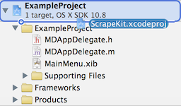
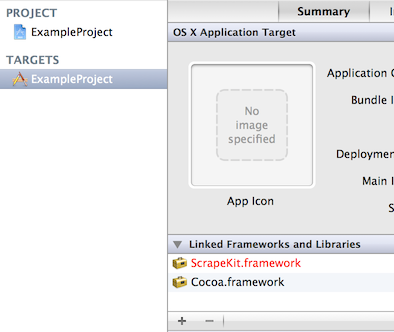

# ScrapeKit Documentation #

## Installation ##
The recommended installation method is to add ScrapeKit as a git submodule within your project.  If you're unfamiliar with this technique, follow the steps outlined below.

### Register ScrapeKit as a Submodule ###
I normally put my 3rd-party projects and submodules into a directory called `External/XXX` where `XXX` is the name of the library.  It doesn't really matter where you put it, though.  Run the following commands from the root of your project.

	git submodule init
	git submodule add git://github.com/edwardaux/ScrapeKit.git External/ScrapeKit

### Make Your Project Aware of ScrapeKit ###
So, now you have the latest ScrapeKit code inside your project directory.  But Xcode still isn't aware of properly yet.  The first step is to drag the newly added `ScrapeKit.xcodeproj` into your project navigator.

Next up, in the *Summary* tab for your target, add ScrapeKit.framework in the *Linked Framework and Libraries* section.

Then, open the *Build Phases* tab for your target, and add ScrapeKit.framework as a *Target 
Dependency*.  

Lastly, in the *Build Settings*, you will need to add `-ObjC` to the *Other Linker Flags*.

And now you should be good to go.  Perform a build.

## Script Layout ##
The general layout of a script file can contain the following elements:
### Comments ###
Comments are defined as anything after a `#` character.  Everything after that to the end of the line is ignored.

### Functions ###
You can define your own functions in a ScrapeKit script by using `@xxxx` where `xxxx` is the name of your function.  Exit of a function occurs when there are no more rules to evaluate.  Some example functions are defined below:

	@myfunc
		# push some data onto the stack
		PushBetween "
" exclude "
" exclude
		# now call another function to do something
		Call anotherfunc
		# and save the result
		PopInto myvar
		
	@anotherfunc
		# do some stuff with the input and push result onto the stack
		# ...
		PushBetween "<a>" exclude "</a>" exclude

You can pass data into functions by pushing it onto the stack before calling it.  Likewise, if a function needs to return data, it can push it onto the stack before it returns.

The ScrapeKit engine expects, at a minimum, a function called `main` that will be used as the entry point for the execution.

### Labels ###
You can define a label by using a colon-prefixed label. eg. `:xxxx`  A label is normally used to control script logic flow in conjunction with the `Goto` rule.

### Indenting ###
Leading whitespace is ignored, but encouraged to maintain readability.

### Strings ###
ScrapeKit is very simplistic in that all function names, labels, rule names, parameters are treated as simple strings. If you need to define a string that has embedded spaces, you must enclose it within `"` characters.  If your string contains a `"` character, then it must be escaped with a `\` character. For example, `"<a href=\"blah.html\">"`

### Flow Control ###
There are a couple of rules that can be used to control the flow within your script.  Specifically, `IfSuccess`, `IfFailure`, `Goto`, and `Invoke`.  

* `IfSuccess` and `IfFailure` shifts the execution location to the passed *label* based on the success/failure of the previous rule.  The definition of success or failure varies from rule to rule and can be seen in the header file for the respective rule. For example, see [SKAssignVarRule.h](ScrapeKit/Classes/Engine/Rules/SKAssignVarRule.h).
* `Invoke` simply invokes another ScrapeKit function (and can be used recursively).  
* `Goto` unconditionally shifts the execution to the specified *label*. 

## Variable Management ##
ScrapeKit uses a single global variable pool that is available to all functions and rules within a script.  Each script uses its own variable pool.

There several ways data can be stored as variables:

* Saving directly into an `NSString`
* Adding to the end of a `NSMutableArray`
* Adding to a `NSMutableDictionary`
* Setting properties on objects using `setValue:forKey:` 

## Rules ##
### Built-in Rules ###
ScrapeKit comes with a number of pre-built rules that should cover most text parsing cases.  The header files for each contain a more detailed explanation of each rule.

#### Variable Management ####
* `AssignConst` - Assigns a constant to a variable and/or property.
* `AssignVar` - Assigns a variable to another variable and/or property.
* `CreateVar` - Creates a new variable in the global variable pool.
* `PopIntoVar` - Pops text off the text stack into a variable and/or property.

#### Flow Control ####
* `Goto` - Unconditionally switches execution to a particular label.
* `IfSuccess` - Switches execution to a label based on success of previous rule.
* `IfFailure` - Switches execution to a label based on success of previous rule.
* `Invoke` - Invokes a sub-function.  Can be used recursively.
* `Label` - A nop rule that provides a target for the other flow control rules.

#### Stack / Text Management ####
* `Pop` - Pops a single text buffer off the text stack.
* `PushBetween` - Searches for a piece of text within other text and pushes it onto the text stack for later processing.

### Error Handling ###
Every rule returns a `BOOL` indicating success or failure.  You can use the `IfSuccess` and `IfFailure` rules to interrogate the success/failure of the previous rule.  

## Debugging ##
### Built-in Logging ###
ScrapeKit provides some built-in console-based debugging using the `SKConsoleDebugger`.  You can pass the an instance of this class to the `SKEngine` object, and it will output detailed information about each rule as it is evaluated, along with the state of the text stack.

	SKEngine *engine = [[SKEngine alloc] init];
	[engine setDebugger:[[SKConsoleDebugger alloc] init]];

An example of the output that it provides as as follows:

	...
	main[iffailure] ---------------------------------------------------
	main[iffailure] Evaluating last failure (lastSuccess=YES)
	main[iffailure] Success=YES
	main[goto] ---------------------------------------------------
	main[goto] Jumping to "loop"
	main[goto] Success=YES
	main[loop] ---------------------------------------------------
	main[loop] Success=YES
	main[invoke] ---------------------------------------------------
	main[invoke] Invoking "handleRow"
	   > 0 <td>20</td><td>21</td>
	   > 1 </tr> </table> 
	  handleRow[createvar] ---------------------------------------------------
	  handleRow[createvar] Creating variable of type "NSMutableArray" and assigning to cells
	  handleRow[createvar] Success=YES
	  handleRow[pushbetween] ---------------------------------------------------
	  handleRow[pushbetween] Looking between "<td>" and "</td>" in "<td>20</td><td>21</td>"
	  handleRow[pushbetween] Pushing "20" onto text stack
	  handleRow[pushbetween] Success=YES
	...

If the standard debugger doesn't provide sufficient information for you, you can provide your own implementation as long as it conforms to the `SKDebugger` protocol.

### Setting Breakpoints ###
At development time, it is sometimes useful to be able to set a breakpoint in Xcode4 and inspect the contents of the text stack and the variable pool.  ScrapeKit provides an internal rule called `Break` that is a no-op rule.  However, what you can do, is set a breakpoint on the `return` statement in [SKBreakRule.m](ScrapeKit/Classes/Engine/Rules/SKBreakRule.m) and Xcode will helpfully pause execution when it gets to that point.  You can then inspect the state of your script using LLDB.

## Writing Custom Rules ##
Further info to come...

